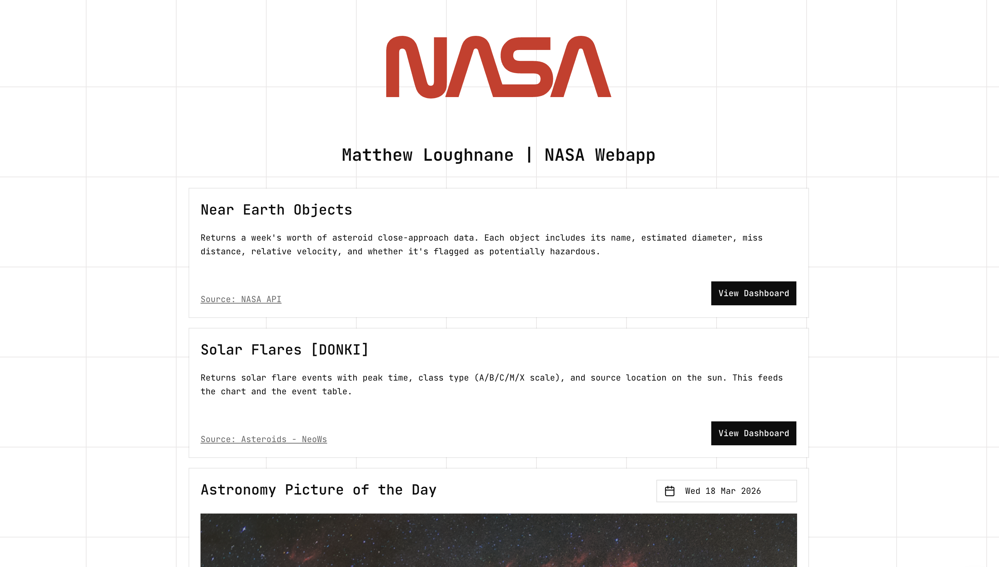
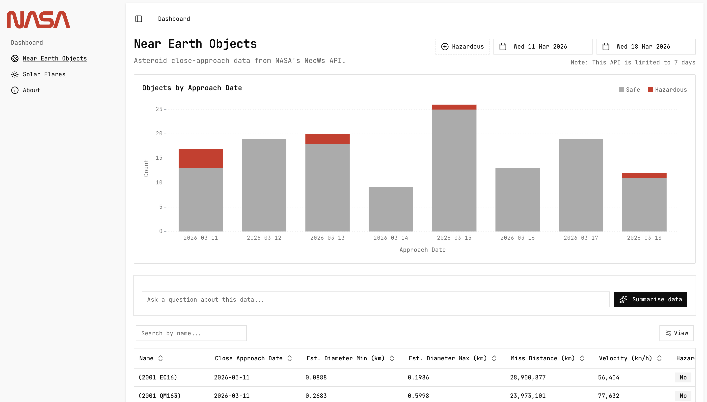

# NASA Dashboard — Matthew Loughnane

Submission for the [Bounce Insights](https://www.bounceinsights.com/) coding challenge. A landing page and dashboard with dense data and a clear, consistent theme.





## Architecture

```
frontend (Next.js)          backend (Express)          NASA APIs
┌─────────────────┐        ┌──────────────────┐       ┌──────────┐
│  React / Visx   │──API──▶│  Controllers     │──────▶│  NEO     │
│  Tanstack Query │◀──JSON─│  Services + Cache │◀─────│  DONKI   │
│  TailwindCSS    │        │  Zod Validation   │       │  APOD    │
└─────────────────┘        │  Gemini AI        │       └──────────┘
     :3000                 └──────────────────┘
                                :4000
```

The frontend proxies `/api/*` to the backend via Next.js rewrites. The backend validates all inputs with Zod, caches NASA responses in-memory (LRU, 6 h TTL), and handles pagination server-side.

## Frontend

- **Theme:** A squared theme based on the NASA worm logo, using the same red throughout with dark mode support (press `d` to toggle).
- **Design:** [TailwindCSS](https://tailwindcss.com/) with [ui.shadcn](https://ui.shadcn.com/) components.
- **Tech:** [Next.js (App Router)](https://nextjs.org/), [Tanstack Query](https://tanstack.com/query/latest), [Tanstack Table](https://tanstack.com/table/latest), [DiceUI Table](https://www.diceui.com/docs/components/data-table), [Visx](https://airbnb.io/visx/).

## Backend

- **Tech:** [ExpressJS](https://expressjs.com), [Helmet](https://helmetjs.github.io/) for security headers, [Winston](https://github.com/winstonjs/winston) for structured logging.
- In-memory LRU caching per date range so repeated requests skip the NASA API call. Pagination is handled server-side.
- Zod schema validation on all query parameters via middleware.

## API Endpoints

All responses follow the envelope: `{ status: "ok" | "error", message: string, data: T | null }`.

### `GET /neo`

Near Earth Objects for a date range.

| Param | Type | Required | Notes |
|-------|------|----------|-------|
| `start_date` | `YYYY-MM-DD` | Yes | |
| `end_date` | `YYYY-MM-DD` | Yes | Max 7-day range (NASA limit) |
| `page` | number | No | 1-based, defaults to all |
| `page_size` | number | No | Defaults to 30, max 100 |

```bash
curl "http://localhost:4000/neo?start_date=2025-01-01&end_date=2025-01-07&page=1&page_size=10"
```

### `GET /flr`

Solar Flare events from NASA DONKI.

| Param | Type | Required | Notes |
|-------|------|----------|-------|
| `start_date` | `YYYY-MM-DD` | Yes | |
| `end_date` | `YYYY-MM-DD` | Yes | |
| `page` | number | No | 1-based |
| `page_size` | number | No | Defaults to 30, max 100 |

```bash
curl "http://localhost:4000/flr?start_date=2025-01-01&end_date=2025-01-31"
```

### `GET /apod`

Astronomy Picture of the Day.

| Param | Type | Required | Notes |
|-------|------|----------|-------|
| `date` | `YYYY-MM-DD` | No | Defaults to today |

```bash
curl "http://localhost:4000/apod?date=2025-06-01"
```

### `POST /summary/:type`

AI-generated summary of NEO or FLR data (powered by Gemini).

| Param | Location | Type | Required | Notes |
|-------|----------|------|----------|-------|
| `type` | path | `neo` or `flr` | Yes | |
| `start_date` | body | `YYYY-MM-DD` | Yes | |
| `end_date` | body | `YYYY-MM-DD` | Yes | |
| `question` | body | string (max 500) | No | Custom question about the data |

```bash
curl -X POST http://localhost:4000/summary/neo \
  -H "Content-Type: application/json" \
  -d '{"start_date":"2025-01-01","end_date":"2025-01-07"}'
```

### `GET /health`

Health check endpoint. Returns `{ status: "ok" }`.

## Tools

- Claude Code was used to develop UI and generate test cases — reviewed and run before committing.

## Installation

### Prerequisites

- [Node.js](https://nodejs.org/) v20+
- [pnpm](https://pnpm.io/)
- A [NASA API key](https://api.nasa.gov/) (optional for development — falls back to `DEMO_KEY`)

### Backend

```bash
cd backend
pnpm install
cp .env.example .env   # then fill in your keys
pnpm dev
```

Build and run for production:

```bash
pnpm build && pnpm start
```

### Frontend

```bash
cd frontend
pnpm install
cp .env.example .env.local   # then fill in your keys
pnpm dev
```

Build and run for production:

```bash
pnpm build && pnpm start
```

The frontend runs on `http://localhost:3000` and the backend on `http://localhost:4000`.

### Environment Variables

See `.env.example` in each directory. Key variables:

| Variable | Where | Required | Description |
|----------|-------|----------|-------------|
| `NASA_API_KEY` | backend | Yes (prod) | NASA API key from [api.nasa.gov](https://api.nasa.gov/) |
| `GEMINI_API_KEY` | backend | Yes | Google Gemini API key for AI summaries |
| `PORT` | backend | No | Server port (default: 4000) |
| `CORS_ORIGIN` | backend | No | Allowed origins (default: `http://localhost:3000`) |
| `RATE_LIMIT_MAX` | backend | No | Max requests per window (default: 100) |
| `NEXT_PUBLIC_SITE_URL` | frontend | No | Base URL for SEO metadata |
| `BACKEND_URL` | frontend | No | Backend URL for API proxy (default: `http://localhost:4000`) |

### Tests

```bash
# Frontend
cd frontend && pnpm test

# Backend
cd backend && pnpm test
```

## Hosting

Hosted on a personal VPS using Coolify with nixpacks. Redeploys on git push. Both applications could go straight onto Vercel / Railway / Heroku or GCP Cloud Run without changes.

## Stray Notes

- The NEO page makes two calls — one for the full data (chart) and one paginated (table). This ensures the chart always shows the complete date range rather than just the current page.
- Visx was used for charting to learn something new. Ordinarily would reach for [recharts](https://recharts.github.io/) or [d3](https://d3js.org/).
- The red colour scheme fits the NASA worm logo but wouldn't be a typical choice — red has negative/destructive connotations that make error states harder to differentiate.
- API logging isn't set up to rotate and logs are stored locally. For production, would use a logging service or Grafana.

## Next Steps

- Add more API endpoints.
- Add a memory for the AI functionality.
- Add more tests for coverage.
- Re-use this theme for another project.
